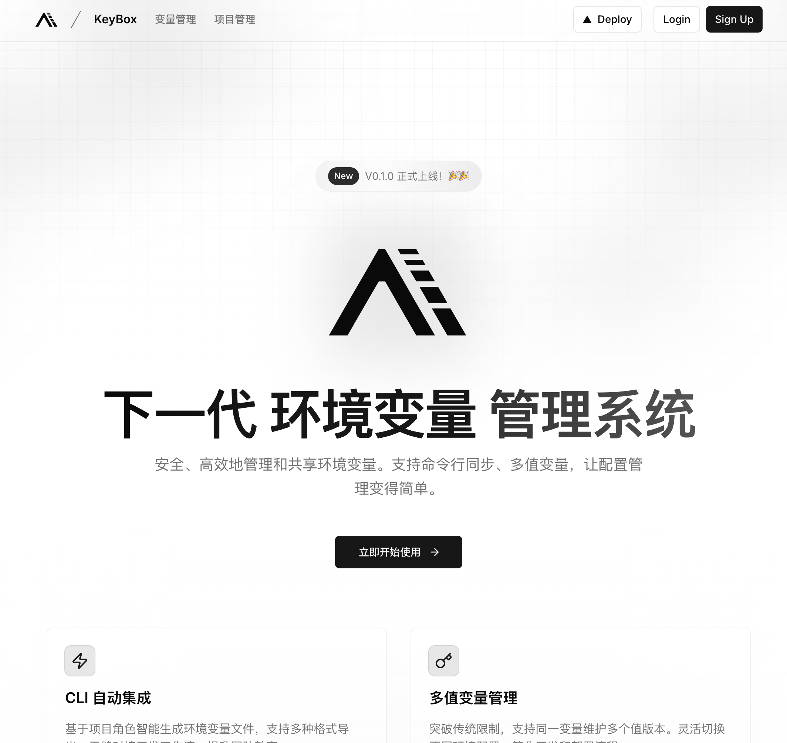

# KeyBox

🔐 下一代环境变量管理系统，集成 Web 界面与命令行工具，让配置管理更简单、更安全。



## ✨ 核心特性

### 🛡️ 零信任加密
- 端到端加密技术，确保环境变量的绝对安全
- 支持密钥轮换和访问审计
- 满足企业级安全标准

### 🔄 多值变量管理
- 突破传统限制，支持同一变量维护多个值版本
- 灵活切换不同环境配置
- 简化开发和部署流程

### ⚡️ CLI 自动集成
- 基于项目角色智能生成环境变量文件
- 支持多种格式导出
- 无缝对接开发工作流，提升团队效率

### 🌐 开源私有部署
- 完全开源，支持一键私有化部署
- 掌控数据主权，按需定制功能
- 打造专属配置管理平台

## 🏗️ 技术架构

本项目采用 monorepo 架构：

- **包管理器**：pnpm
- **前端**：@packages/web (Next.js 14 + App Router)
- **后端**：@packages/api (Express)
- **数据库**：Supabase
- **状态管理**：Jotai + React Query

## 🚀 快速开始

### 开发环境配置

1. 克隆仓库
```bash
git clone https://github.com/MarkShawn2020/2025-02-04_keybox.git
cd keybox
```

2. 安装依赖
```bash
pnpm install
```

3. 配置环境变量
```bash
# API 包 (.env)
PORT=3001
SUPABASE_URL=your-project-url
SUPABASE_SERVICE_KEY=your-service-role-key

# Web 包 (.env)
NEXT_PUBLIC_SUPABASE_URL=your-project-url
NEXT_PUBLIC_SUPABASE_ANON_KEY=your-anon-key
```

4. 启动开发服务器
```bash
pnpm dev
```

### 数据库结构

本项目使用以下数据表：

#### keys
环境变量和 API 密钥存储
- `id`: UUID (主键)
- `name`: 变量名称
- `value`: 变量值
- `description`: 描述
- `tags`: 标签数组
- `revoked`: 是否已失效
- `user_id`: 用户ID
- `created_at`, `updated_at`: 时间戳

#### solutions
解决方案（变量组）
- `id`: UUID (主键)
- `name`: 方案名称
- `description`: 描述
- `user_id`: 用户ID
- `created_at`, `updated_at`: 时间戳

#### solution_keys
解决方案与变量的多对多关系
- `solution_id`: 解决方案ID
- `key_id`: 变量ID

## 🤝 贡献

欢迎提交 Pull Request 或创建 Issue！

## 📄 许可证

[MIT License](./LICENSE)

- Service role key for admin operations
- Anonymous key for public operations

## 🚀 Getting Started

### Prerequisites
```bash
# Installation instructions will be added
```

### Installation
```bash
# Installation steps will be added
```

## 📖 Usage

### Web Interface
1. Login to the web platform
2. Create and manage your API keys
3. Create solutions (key combinations)
4. Manage access and permissions

### CLI
```bash
# Login to your account
KeyBox login

# List available solutions
KeyBox list

# Generate .env file from a solution
KeyBox pull <solution-name>

# Update existing .env file
KeyBox sync
```

## 🔒 Security

- All sensitive data is encrypted at rest
- Secure transmission using TLS
- Regular security audits
- Access control and permission management

## 🤝 Contributing

Guidelines for contributing will be added soon.

## 📄 License

MIT License - see LICENSE file for details
