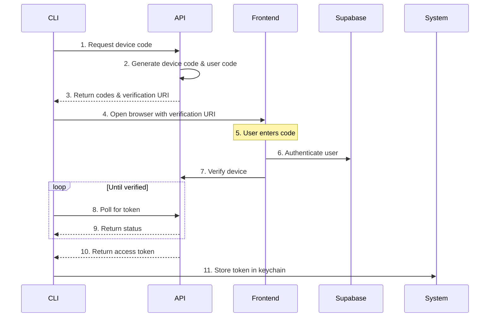

# CLI Authentication Flow

## Overview

KeyBox CLI uses the Device Flow authentication pattern, which is specifically designed for command-line applications where direct user input of credentials is not practical or secure.

## Flow Details



## Implementation

### CLI Side

```typescript
// 1. Check existing token
const token = await keytar.getPassword(SERVICE_NAME, 'token')
if (token) {
  const user = await getCurrentUser(token)
  if (user) return // Already logged in
}

// 2. Get device code
const { data } = await axios.post('/auth/device/code')
console.log(`Enter code: ${data.user_code}`)

// 3. Open browser
await open(data.verification_uri)

// 4. Poll for token
while (true) {
  const { data } = await axios.post('/auth/device/token', {
    device_code: data.device_code
  })
  if (data.token) {
    await keytar.setPassword(SERVICE_NAME, 'token', data.token)
    break
  }
  await sleep(data.interval * 1000)
}
```

### API Side

```typescript
// 1. Generate device code
app.post('/auth/device/code', (req, res) => {
  const codes = generateCodes()
  cache.set(codes.device_code, { status: 'pending' })
  res.json({
    device_code: codes.device_code,
    user_code: codes.user_code,
    verification_uri: '/verify-device',
    interval: 5
  })
})

// 2. Handle verification
app.post('/auth/device/verify', async (req, res) => {
  const { user_code, session } = req.body
  const device = cache.get(user_code)
  if (!device) return res.status(404)
  
  device.status = 'verified'
  device.session = session
  cache.set(user_code, device)
  res.json({ success: true })
})

// 3. Exchange token
app.post('/auth/device/token', (req, res) => {
  const { device_code } = req.body
  const device = cache.get(device_code)
  
  if (!device) return res.status(404)
  if (device.status === 'pending') {
    return res.status(400).json({ 
      error: 'Authorization pending' 
    })
  }
  
  res.json({ token: device.session.access_token })
})
```

### Frontend Side

```typescript
// 1. Verify device page
export default function VerifyDevice() {
  const [code, setCode] = useState('')
  
  const handleVerify = async () => {
    const { data: { session } } = await supabase.auth.signIn()
    await axios.post('/api/auth/device/verify', {
      user_code: code,
      session
    })
  }
  
  return (
    <div>
      <input 
        value={code} 
        onChange={e => setCode(e.target.value)} 
        placeholder="Enter device code"
      />
      <button onClick={handleVerify}>
        Verify Device
      </button>
    </div>
  )
}
```

## Security Considerations

1. **Token Storage**: Use system keychain (via keytar) for secure token storage
2. **Code Expiry**: Device codes expire after a set time (e.g., 15 minutes)
3. **Rate Limiting**: Implement polling rate limits to prevent abuse
4. **Code Format**: Use human-friendly codes (e.g., XXXX-XXXX)
5. **HTTPS**: All API communication must be over HTTPS in production

## Error Handling

1. **Device Code Expired**: Prompt user to restart flow
2. **Invalid Code**: Clear feedback for mistyped codes
3. **Network Issues**: Retry with exponential backoff
4. **Browser Launch**: Fallback to manual URL copy
5. **Token Validation**: Auto-logout on invalid tokens

## User Experience

1. **Clear Instructions**: Guide users through the process
2. **Progress Indication**: Show polling status
3. **Auto Browser**: Open verification page automatically
4. **Manual Fallback**: Support manual code entry
5. **Session Info**: Show username and last login after success

## References

1. [OAuth 2.0 Device Flow](https://oauth.net/2/device-flow/)
2. [RFC 8628: OAuth 2.0 Device Grant](https://tools.ietf.org/html/rfc8628)
3. [Supabase Auth Documentation](https://supabase.io/docs/guides/auth)
